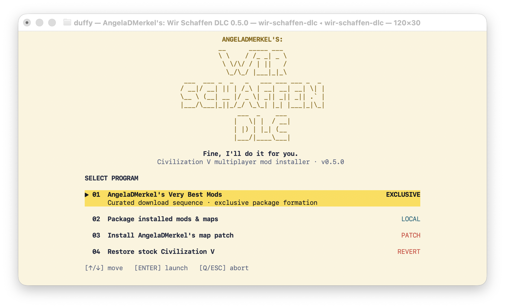

# Wir Schaffen DLC

Wir Schaffen DLC is a macOS utility for using Civilization V mods in ordinary
single-player and multiplayer sessions. It converts supported ModBuddy mods
and maps into authenticated `.Civ5Pkg` DLC, installs them transactionally, and
keeps the complete workflow inside a full-screen terminal interface.

<p align="center">
  
  <br>
  <em>The Wir Schaffen DLC main screen</em>
</p>

## Features

- A responsive full-screen TUI with arrow-key navigation, themed prompts,
  progress bars, download percentages, byte totals, transfer speed, packaging
  status, transactional installation, and in-interface error reporting.
- **AngelaDMerkel's Very Best Mods**, an exclusive curated installation that
  downloads seven fixed sources, verifies their Workshop identity, archive,
  ModBuddy manifest and SHA-256 provenance, then packages them together.
- Local packaging for installed ModBuddy mods, Lua map scripts and standalone
  v11/v12 `.Civ5Map` files discovered from the active Civ V installation.
- Authenticated multiplayer DLC manifests, deterministic database and
  localization loading, virtual-file collision detection, and one shared UI
  bridge for otherwise competing `InGameUIAddin` scripts.
- Dedicated compatibility compilers for Future Worlds, Corporations, Really
  Advanced Setup and Mass Effect Civilizations, with malformed source XML and
  unsupported database operations rejected or translated explicitly.
- An Excogitare compatibility patch that registers Extreme and Colossal world
  sizes and applies a signature-checked, reversible native guard for extreme
  dimensions and aspect ratios.
- A complete stock-restoration path that removes only authenticated
  Wir Schaffen DLC packages, restores and verifies the original executable,
  and invalidates only rebuildable game caches.
- Standalone Apple Silicon and Intel releases; Python is not required on the
  destination Mac.

## Programs

| Program | Function |
| --- | --- |
| **01 · AngelaDMerkel's Very Best Mods** | Download, verify, package and install the complete curated collection. |
| **02 · Package installed mods & maps** | Select compatible content already present in this Civ V installation and install it as multiplayer DLC. |
| **03 · Install AngelaDMerkel's map patch** | Add Excogitare's custom world sizes and the reversible native geometry guard. |
| **04 · Restore stock Civilization V** | Remove verified tool-owned DLC, restore the stock executable and rebuild the game database cache. |

## Install and run

Download the appropriate archive from the
[latest release](https://github.com/AngelaDMerkel/Wir-Schaffen-DLC/releases/latest):

- `arm64` for Apple Silicon Macs.
- `x86_64` for Intel Macs.

Extract it, quit Civilization V, then double-click **Wir Schaffen DLC.command**.
The release is ad-hoc signed rather than Apple-notarized, so the first launch
may require Control-clicking the command and choosing **Open**.

From a repository checkout, run:

```sh
./wir-schaffen-dlc.command
```

The installer automatically discovers the standard Steam game, `MODS`, `Maps`
and DLC locations. Use `--game-app` and `--user-data` for a non-standard Steam
library. Every multiplayer participant must install the same generated
packages and, when required, the same native map guard.

See the [usage guide](docs/usage.md) for automation options and detailed paths,
the [compatibility matrix](docs/compatibility.md) for tested content, and the
[changelog](CHANGELOG.md) for release history.

## Development

Python 3.9 or newer is sufficient for the packer and installer source. Run the
test suite with:

```sh
python3 -m unittest discover -s tests -v
```

## Project relationship

Wir Schaffen DLC was developed while investigating native macOS support for
[MPPatch](https://github.com/Lymia/MPPatch). MPPatch modifies the game runtime;
this project translates supported mods into DLC and manages its own narrow,
reversible native map guard. They are separate projects with independent
histories.

## Licence

Wir Schaffen DLC is licensed under the [MIT License](LICENSE). Third-party and
source attribution is recorded in [NOTICE](NOTICE).
